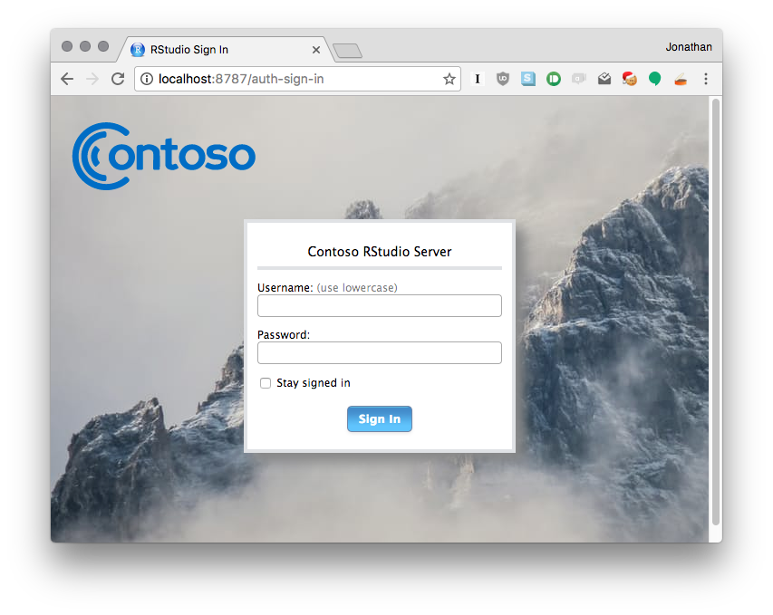

```{r setup, echo=FALSE}
library(DiagrammeR)
library(magrittr)
```


## Customize Login Page



## Customize Login Page

Edit:

    /etc/rstudio/login.html

- Code is injected **after** the login box.
- Use CSS to position elements elsewhere on the page
- Use JS to modify the page

## High Availability 

- Use multiple RStudio Server Pro instances as failovers for each other
- Provide service to analysts even if one or more machines are down
- Supported using RStudio Server Pro "Multiple Masters" load balanced configuration

## High Availability 

```{r, echo=FALSE}
grViz(diagram="high-availability.gv")
```

## Log everything that goes to the R console


## Try a new version of R
## See a list of your projects and sessions by default
## Pair program and code review 
## Get notified when RSP goes down (Nagios + health check)
## Run stuff prior to starting an rsession (/etc/rstudio/rsession...)
## Disable publishing and downloading
## Distribute CPU resources via cpu-affinity
## Use a version of R per project
## Store new projects and sessions outside home dir
## Change where the user package library is located
## Lock users to a load balanced node
## Impersonate a user
## Set default settings for new users
## Log R session activity
## Immortal sessions
## Graphite monitoring
## Run in Docker
## Open project in a new session
